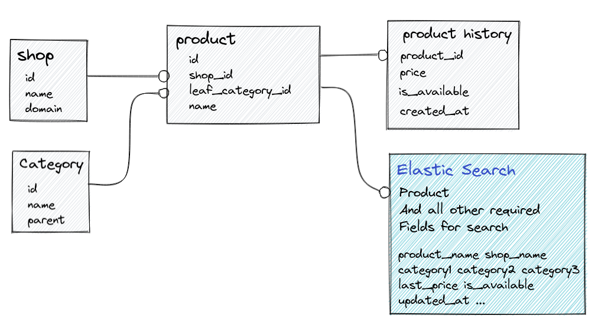

## سرویس Core

در سرویس core هدف ما این است که داده‌های مربوط به محصولات و تغییرات قیمت آنها/دسته‌بندی آن ها/داده مربوط به فروشگاه ها را نگه‌داری و پردازش کنیم.


**دسته بندی**: دسته ها ساختار سلسه مراتبی داشته و هر دسته، یک پدر دارد برای مثال "موبایل و تبلت" پدر "موبایل" و "موبایل" پدر "موبایل آیفون" میباشد. محصولات تنها با دسته های برگ ارتباط دارند و دسته های پدر تنها برای فیلتر کردن استفاده میشود. 

**فروشگاه**: اطلاعات مربوط به فروشگاه ها توسط ادمین تکمیل میشود.

**محصول**: هر محصول با یک دسته برگ و یک فروشگاه ارتباط دارد. محصولات علاوه بر مشخصات ظاهری مانند عنوان، ویژگی ها و توضیحات شامل قیمت و وضعیت موجودی نیز میباشد. محصولات توسط یک سرویس دیگر کراول شده و اطلاعات آن ها باید در پایگاه داده ذخیره شود تا حسب نیاز به کاربر نمایش داده شود.

**تغییرات قیمت**: هر بار که یک محصول کراول میشود. ممکن است قیمت و وضعیت موجودی آن تغییر کند. لازم است این تغییرات قیمت و وضعیت موجودی نیز برای هر محصول ذخیره شود.


برای اینکه سرویس به شکل خوبی پیاده کنیم، فرضیات زیر رو داشتیم:

1. اطلاعات رو باید به نحوی داشته باشیم که بتونیم تعداد قابل توجهی request سرچ رو جواب بدیم
2. لزومی نداره نتایج write به صورت لحظه ای روی پاسخ request ها اعمال شن
3. اطلاعات رو تا جای ممکن به صورت یکپارچه داشته باشیم

برای اینکه بتونیم تا جای ممکن به این خواسته های فرضی برسیم، راه حل های زیر به نظرمون رسید:

### روش اول:


روش اولی که به ذهن میرسه اینه که مدل های بالا رو در یک دیتابیس sql تعریف کنیم

خوبی این روش این هست که اطلاعات به صورت یکپارچه ذخیره میشن و به خواسته consistency میتونیم برسیم

بدی این روش این هست که سرچ کردن نیازمند چندین join در دیتابیس هست و همچنین قابلیت تعریف ایندکس موثری در جداول وجود نداره

### روش دوم:


برای اینکه به performance بهتری نسبت به روش قبلی برسیم، میتونیم اطلاعات رو در جدول products نرمالایز کنیم، به این صورت
دیگه نیاز نیست چندین join داشته باشیم، و همچنین میتونیم index به این فیلد ها اضافه کنیم

بدی این روش این هست که در مدل های اصلی اطلاعات تکراری ذخیره میکنیم، یکپارچگی اطلاعات رو از دست میدیم، مثلا در زمان آپدیت
در مدل های category یا shop، نیاز هست که تعداد زیادی رکورد رو در مدل product تغییر بدیم

### روش سوم:


صرفا برای اینکه دیتای تکراری و غیر یکپارچه رو از بقیه دیتا ها جدا کنیم، میتونیم از materialized view استفاده کنیم و
request های سرچ رو با استفاده از این view پاسخ بدیم

خوبی این روش نسبت به روش قبلی این هست که میدونیم اطلاعات تکراری در مدل های اصلی پروژه ذخیره نمیشن، و میتونیم یکپارچگی رو
در اون مدل ها تضمین کنیم، از اون طرف هم خوبی های performance روش دوم رو در این روش هم داریم (همچنان میتونیم ایندکس
بسازیم)

بدی این روش رو دو مورد میبینم، مورد اول این هست که روش پیچیده ای هست و هزینه پیاده سازیش احتمالا زیاد هست

مورد دوم این هست که با اینکه میتونیم ایندکس های تکی یا ترکیبی برای فیلد ها داشته باشیم، ولی احتمالا همچنان نمیتونیم به
صورت کاملا بهینه (مثلا logn) به همه درخواست ها جواب بدیم، چون تعداد filter های مختلف و sorting های مختلف زیاد هست

### روش چهارم:



در این روش مثل روش قبلی دیتای اصلی رو در postgres نگه میداریم و هر چند وقت یکبار elastic search رو آپدیت میکنیم

خوبی این روش احتمالا performance بهتر نسبت به همه روش های قبلی هست، همچنین یکپارچگی داده های اصلی رو میتونیم حفظ کنیم

بدی این روش این هست که اطلاعات سرچ در لحظه آپدیت نمیشن
و همچنین این روش پیچیدگی پیاده سازی بالاتری نسبت به روش های اول داره

در نهایت تصمیم من این شد که روش چهارم رو پیاده سازی کنم

## اجرا 

قبل از اجرا لازم است که فایل ```.sample.env``` رو به ```.env``` تغییر نام دهید

با دانلود کردن فایل ``docker-compose.yml`` و اجرای آن با دستور ```docker compose up -d``` برنامه در port 8080 اجرا میشود

#### ماک Suggestion
برای mock سرویس suggestion، میتوانید از prism :استفاده کنید
```commandline
nvm use v16
npm install -g @stoplight/prism-cli
prism mock q1/suggestion.yml
```

### Test Coverages:
```commandline
Name                               Stmts   Miss  Cover
------------------------------------------------------
manage.py                             12      2    83%
project1/__init__.py                   0      0   100%
project1/asgi.py                       4      4     0%
project1/settings/__init__.py          0      0   100%
project1/settings/development.py      23     23     0%
project1/settings/production.py        3      3     0%
project1/urls.py                       3      0   100%
project1/wsgi.py                       4      4     0%
store/__init__.py                      0      0   100%
store/admin.py                        10      0   100%
store/apps.py                          4      0   100%
store/documents.py                    28      8    71%
store/dtos.py                        105      8    92%
store/migrations/0001_initial.py       8      0   100%
store/migrations/__init__.py           0      0   100%
store/models.py                       54      4    93%
store/urls.py                          4      0   100%
store/utils.py                         8      0   100%
store/views.py                        62     19    69%
tests/__init__.py                      0      0   100%
tests/data.py                          9      0   100%
tests/settings.py                      8      0   100%
tests/test_dtos.py                    41      0   100%
tests/test_model_functions.py         34      0   100%
tests/test_views.py                   18      0   100%
------------------------------------------------------
TOTAL                                442     75    83%
```
